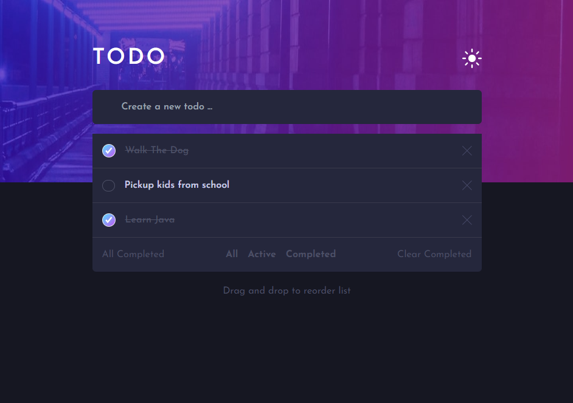
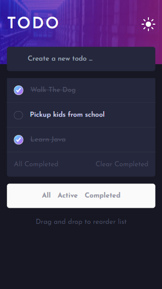

# Frontend Mentor - Todo app solution

This is a solution to the [Todo app challenge on Frontend Mentor](https://www.frontendmentor.io/challenges/todo-app-Su1_KokOW). Frontend Mentor challenges help you improve your coding skills by building realistic projects. 

## Table of contents

- [Overview](#overview)
  - [The challenge](#the-challenge)
  - [Screenshot](#screenshot)
  - [Links](#links)
- [My process](#my-process)
  - [Built with](#built-with)
  - [What I learned](#what-i-learned)
  - [Continued development](#continued-development)
- [Author](#author)

## Overview

### The challenge

Users should be able to:

- View the optimal layout for the app depending on their device's screen size
- See hover states for all interactive elements on the page
- Add new todos to the list
- Mark todos as complete
- Delete todos from the list
- Filter by all/active/complete todos
- Clear all completed todos
- Toggle light and dark mode
- **Bonus**: Drag and drop to reorder items on the list

###### Screenshot

###### Desktop Preview

### Mobile Preview

### Links

- Solution URL: [github](https://github.com/coderMicah/todo-app-challenge)
- Live Site URL: [micah-todo-app.netlify.app](https://micah-todo-app.netlify.app/)

## My process

### Built with

- Semantic HTML5 markup
- CSS 
- Tailwind CSS
- Flexbox
- Mobile-first workflow
- [React](https://reactjs.org/) - JS library

### What I learned

Practised context and reducers to create a simple state management.Experienced with hooks also

### Continued development

- Drag and drop to reorder items on the list

## Author

- Frontend Mentor - [@coderMicah](https://www.frontendmentor.io/profile/coderMicah)
- Twitter - [@_micahcodes](https://www.twitter.com/_micahcodes)

